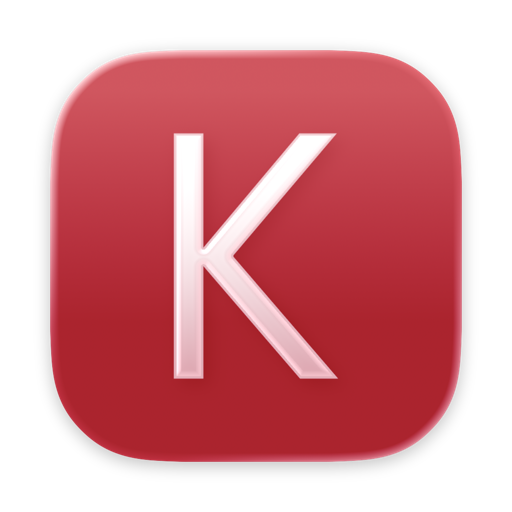
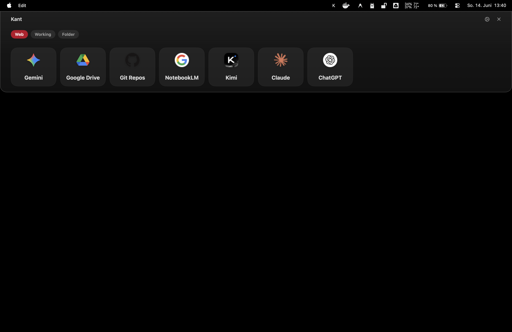
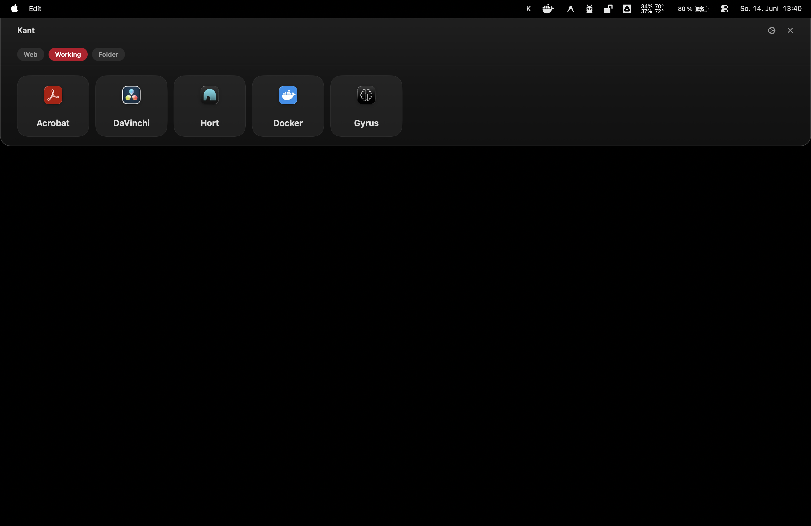
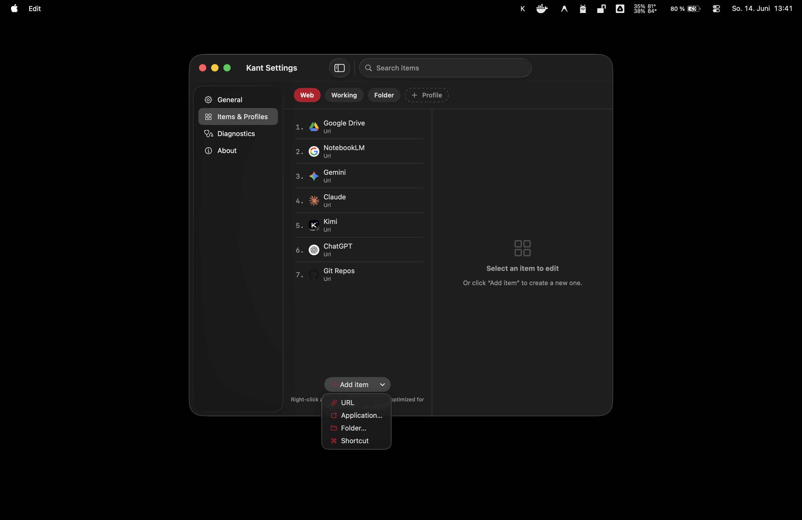

<div align="center">



# Kant

**A fast macOS menu-bar launcher for URLs, apps, folders, and Apple Shortcuts.**

A full-width panel drops down from the top of your screen, allowing you to launch items with a single keystroke before it seamlessly gets out of your way. It can live in the menu bar, the Dock, or both depending on your preference.

<p>
  
  
  
</p>



<em>One keystroke drops the panel down from the top of your screen — then it gets out of the way.</em>

<br/><br/>



<em>Tap a chip to switch profiles — here the <strong>Working</strong> profile, full of apps. Kant reopens to whichever you used last.</em>

<br/><br/>



<em>Manage everything under <strong>Items &amp; Profiles</strong>: add a URL, app, folder, or Shortcut from one menu.</em>

</div>

## Features

- **Launch Anything**: Open URLs, applications, folders, and Apple Shortcuts, each shown with its real icon.
- **Profiles**: Group items into separate profiles and switch between them in the panel. Kant reopens to the profile you used last.
- **Smart Ranking**: Optionally learns from your usage and sorts your most relevant items to the front based on frequency, recency, time of day, weekday, the active app, and the screen.
- **Global Hotkey**: Toggle the panel from anywhere. The default is `⌘⇧K` and can be configured via a recorder in Settings.
- **Keyboard Friendly**: Navigate with arrow keys, or enable number keys to launch items 1–9 and 0 directly.
- **Mouse Shortcut** *(optional)*: Press left and right click simultaneously.
- **Menu Bar or Dock**: Run as a menu-bar app, a Dock app, or both.
- **Clean Aesthetic**: Frosted-glass panel that feels native to macOS.

## Installation

### Prerequisites
- macOS 13.0 (Ventura) or later
- A Swift 6 toolchain (Xcode 16+ or a recent Swift open-source toolchain)

### Option A: Build from source (Recommended)

Because Kant interacts deeply with macOS features like Global Hotkeys and Applescript, it needs specific system permissions. Compiling it yourself on your machine bypasses Apple's Gatekeeper warnings perfectly without requiring a paid Apple Developer account.

```bash
git clone https://github.com/gedankenlust/Kant.git
cd Kant
./Scripts/build-app.sh --install --run
```

This builds the app, installs it directly to `/Applications/Kant.app`, and launches it. On first use, macOS will prompt for the permissions Kant needs. Grant them in **System Settings → Privacy & Security**.

### Option B: Download pre-built ZIP

If you download a pre-compiled `Kant.zip` from the GitHub Releases page, macOS will flag it as "damaged" or block it because it is not signed with a paid Apple Developer certificate.
To bypass this, move `Kant.app` to your Applications folder, then open your Terminal and run:

```bash
xattr -cr /Applications/Kant.app
```
You can then open it normally.

> Ad-hoc signatures change on every rebuild. macOS may re-prompt for permissions after each build. Sign with a Developer ID certificate for a stable identity.

### Quick dev run

For iterating on non-permission-gated UI you can run it directly. Note that the hotkey, mouse shortcut, and Shortcuts execution may not work:

```bash
swift run
```

## Usage

Once Kant is running, it lives in the **menu bar** as a **“K”**. By default, there is no Dock icon or main window.

- **Open the panel**: Press the global hotkey (default `⌘⇧K`) or left-click the menu-bar **K**.
- **Launch an item**: Click a tile, or navigate with the arrow keys and press Return. With number keys enabled, press `1`–`9` or `0`.
- **Close the panel**: Press `Esc` or click anywhere outside it.
- **Switch profiles**: If you have more than one profile, tap its chip at the top of the panel. Kant reopens to whichever profile you used last.
- **Menu**: Right-click (or Ctrl-click) the menu-bar **K** for *Show Panel*, *Settings…*, *Open Config Folder*, and *Quit*.

### Starting Kant

- **Run it normally**: Open `build/Kant.app` (double-click in Finder, or run `open build/Kant.app`). Move it to `/Applications` to keep it around.
- **Start at login**: Add Kant under **System Settings → General → Login Items** so it launches automatically.

## Configuration

Kant stores its configuration in `~/Library/Application Support/Kant/config.json` and its usage history in `usage.json` in the same folder. You can edit the config manually to see changes picked up live, or use the built-in Settings panel via the menu bar. Usage history is automatically pruned to the last 90 days.

### Item Types
- **URL**: Opens any link in your default browser. If the page is already open, Kant focuses that tab instead of duplicating it.
- **App**: Launches a macOS application.
- **Folder**: Opens a folder in Finder.
- **Shortcut**: Runs an Apple Shortcut by its exact name.

Add, edit, reorder, and delete items under **Settings → Items & Profiles**. Use the **Add item** button to pick a type; choosing *Application…* or *Folder…* opens a picker and fills in the icon and name for you.

## Privacy

Configuration and usage history never leave your machine. The only exception is favicons for URL items. They are fetched from DuckDuckGo (`icons.duckduckgo.com`) and Google's favicon service (`google.com/s2/favicons` for specific Google domains). This means the **domains** of your URL items are sent to these services when their icons are loaded. You can turn this off under **Settings → General → Fetch favicons**. If disabled, absolutely nothing leaves your machine and everything stays local.

## Contributing

Contributions are welcome! Please feel free to submit a Pull Request.

## License

This project is licensed under the MIT License. See the [LICENSE](LICENSE) file for details.
